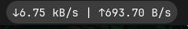

<p align="center">
  
</p>

<h1 align="center">Internet Speed Monitor</h1>

<p align="center">
  A COSMIC desktop applet that monitors internet speed and data usage in real time.
</p>

<p align="center">
  <a href="https://github.com/AceMythos/cosmic-internet-speed-monitor/blob/main/LICENSE">
    
  </a>
  <a href="https://www.rust-lang.org/">
    
  </a>
  <a href="https://github.com/pop-os/libcosmic">
    
  </a>
</p>

---

## Quick start

```sh
sudo apt install iw     # optional: Wi-Fi SSID & link speed
cargo build --release
pkexec install -m 755 target/release/internet-speed-monitor /usr/bin/
pkexec cp internet-speed-monitor.desktop /usr/share/applications/
```

Then add it: **COSMIC Settings → Desktop → Panel → Add applet**.

---

## Features

- **Live speeds** — Download/upload rate in the panel, updated every second
- **Hourly sparkline** — Activity graph for the current day
- **Monthly bar chart** — Per-day totals with highest/average/lowest; click any bar for the value
- **Connection details** — IPv4, IPv6, gateway, DNS, interface, connection duration
- **Wi-Fi info** — SSID, signal strength, link speed
- **Configurable** — Refresh interval, speed units (bps/bytes), panel preset, interface, data retention (7–90 days)
- **Reset** — Clear today's or this month's stats

## Screenshots


## Configuration

| Setting | Default | Description |
|---|---|---|
| Refresh interval | 1s | How often to poll the network interface |
| Speed units | bps | bits per second or bytes per second |
| Panel preset | auto | Bandwidth graph style in the panel |
| Network interface | auto | Which interface to monitor |
| Data retention | 30 days | How long to keep historical stats (7–90) |

## Build from source

Requires Rust 1.80+ and a working COSMIC/Wayland session.

Full build & install instructions: [BUILD.md](BUILD.md)

```sh
git clone https://github.com/AceMythos/cosmic-internet-speed-monitor
cd cosmic-internet-speed-monitor
cargo build --release
```

## Logs

```sh
journalctl -p 3 -xb --user _EXE=/usr/bin/internet-speed-monitor
```

## Contributing

Bug reports, feature requests, and pull requests are welcome.

## License

[GPL-3.0-or-later](LICENSE)
